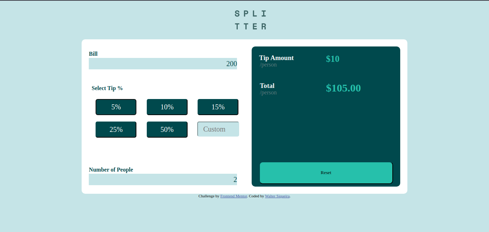

# Frontend Mentor - Tip calculator app solution

This is a solution to the [Tip calculator app challenge on Frontend Mentor](https://www.frontendmentor.io/challenges/tip-calculator-app-ugJNGbJUX). Frontend Mentor challenges help you improve your coding skills by building realistic projects.

## Table of contents

- [Overview](#overview)
  - [The challenge](#the-challenge)
  - [Screenshot](#screenshot)
  - [Links](#links)
- [My process](#my-process)
  - [Built with](#built-with)
  - [What I learned](#what-i-learned)
  - [Author](#author)

**Note: Delete this note and update the table of contents based on what sections you keep.**

## Overview

### The challenge

Users should be able to:

- View the optimal layout for the app depending on their device's screen size
- See hover states for all interactive elements on the page
- Calculate the correct tip and total cost of the bill per person

### Screenshot

Add a screenshot of your solution. The easiest way to do this is to use Firefox to view your project, right-click the page and select "Take a Screenshot". You can choose either a full-height screenshot or a cropped one based on how long the page is. If it's very long, it might be best to crop it.

Alternatively, you can use a tool like [FireShot](https://getfireshot.com/) to take the screenshot. FireShot has a free option, so you don't need to purchase it. 

Then crop/optimize/edit your image however you like, add it to your project, and update the file path in the image above.

**Note: Delete this note and the paragraphs above when you add your screenshot. If you prefer not to add a screenshot, feel free to remove this entire section.**

### Links

- Solution URL: [Add solution URL here](https://your-solution-url.com)
- Live Site URL: [Add live site URL here](https://your-live-site-url.com)

## My process

### Built with
- layout built from mobile to desktop and devided into three sizes on media-queries
- Semantic HTML5 markup
- CSS custom properties
- CSS Grid
- javascript 

**Note: These are just examples. Delete this note and replace the list above with your own choices**

### What I learned

In this project i learned to work with javascript and to work with forms and inputs. also i've improved my skills at css and learned to use grid-template-areas but unfortunatly coudn't learn flex layout

### Continued development

In this project i unfortunately coudn't correct the custom input error and i hove to get better in the future and i had trouble with some default actions of the broser and hope the same

## Author
- GitHub - [WalterSiqueira](https://github.com/WalterSiqueira)
- Frontend Mentor - [@WalterSiqueira](https://www.frontendmentor.io/profile/WalterSiqueira)
- Twitter - [@Walter__BS](https://twitter.com/Walter__BS)

